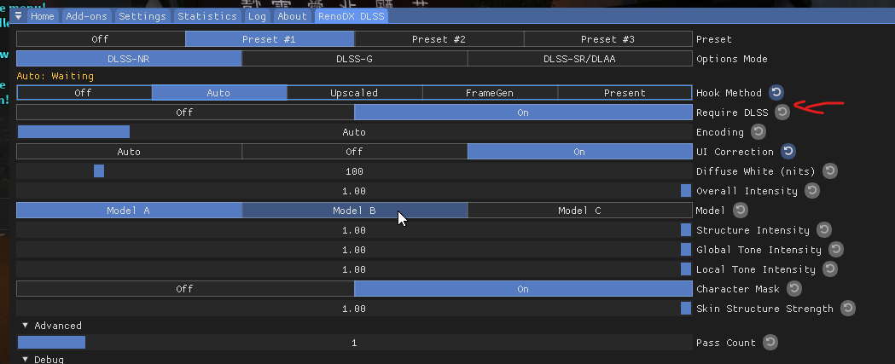
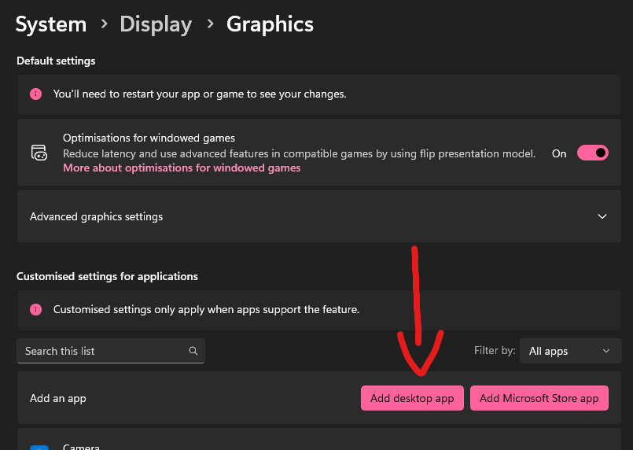
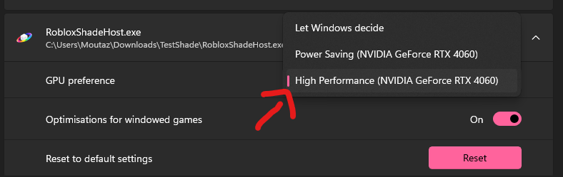

# DLSS5 stuck on "waiting"

If DLSS5 stays on "waiting", follow these steps.

## 1. Turn off "Require DLSS"

In the Unishade menu, click the **DLSS5** tab, then turn off **Require DLSS**.

## 2. Set Unishade to use your RTX GPU

Open Windows **Settings > System > Display > Graphics > Add Desktop App** and add **Unishade.exe** from your installation folder.

Open its graphics options and set **GPU preference** to your **NVIDIA RTX card**. Check the GPU name before saving.

Still need help? Join our [Discord](https://discord.gg/wVbVUdENas) for support.
