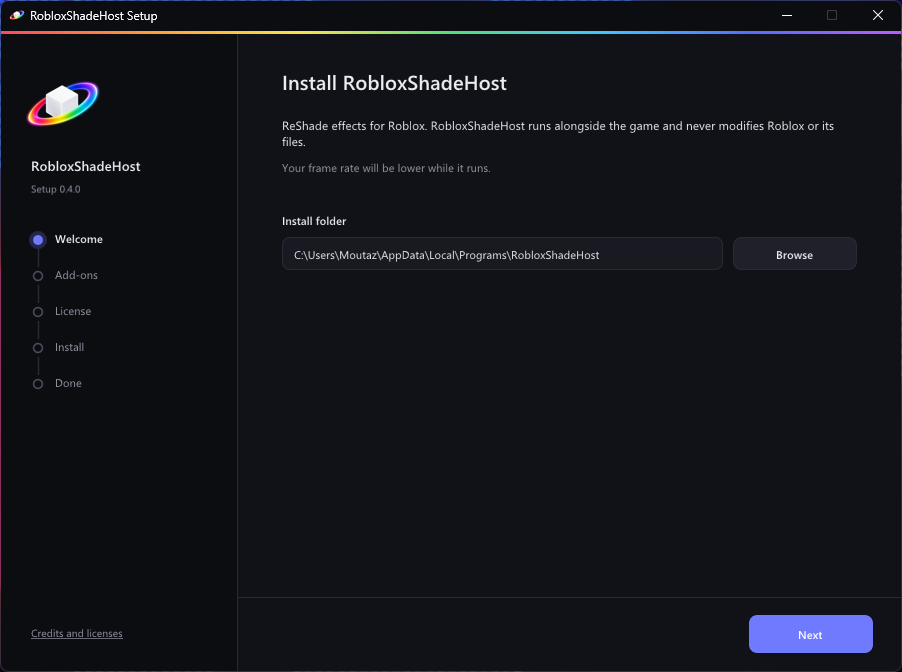
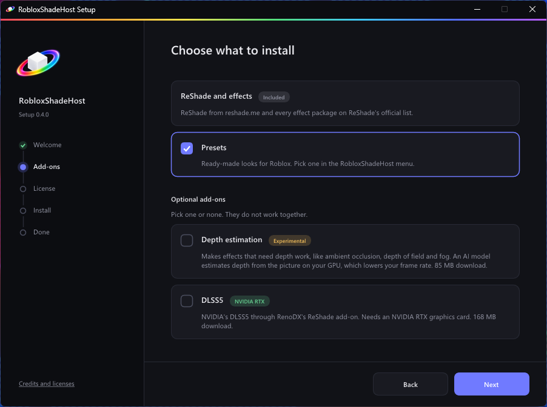
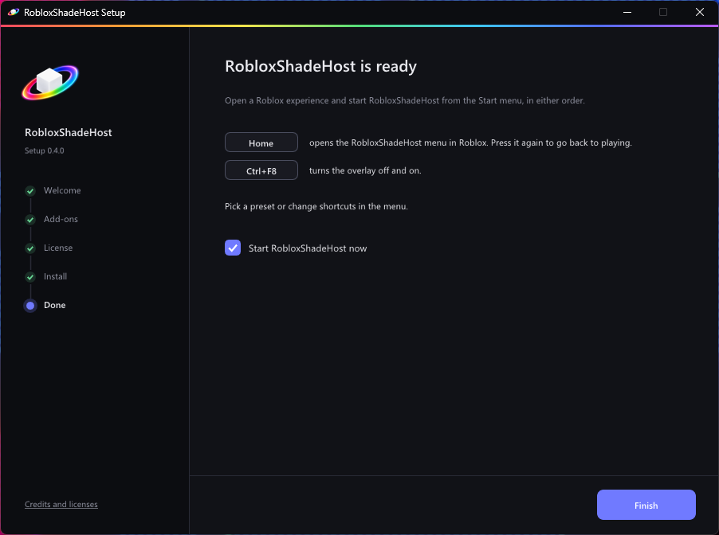
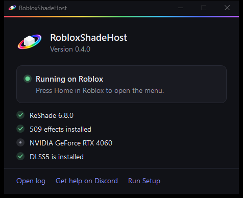
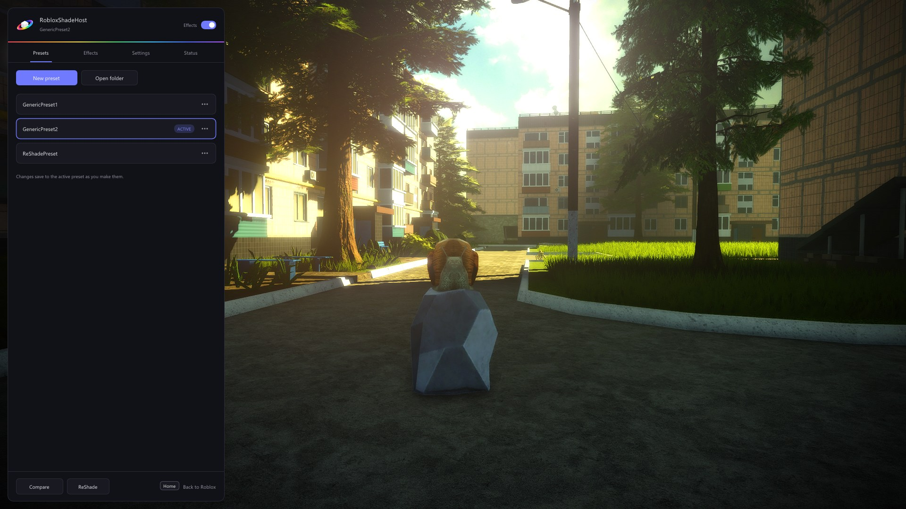

# Installing Unishade

You need 64-bit Windows 10 version 1903 or newer, or Windows 11.

Unishade runs outside the game process and applies post-processing to captured frames. It does not inject DLLs into the game or modify game files during normal operation. It is intended for games where traditional ReShade injection is unavailable or undesirable.

## 1. Run Setup

Download **Unishade-Setup** from the [download page](https://unishade.me/download) and run it. Keep the suggested folder or pick your own. Use a separate folder from the game. Roblox replaces its own folder when it updates.

## 2. Pick add-ons

ReShade and every effect package on ReShade's official list are always installed. Keep **Presets** on for ready-made looks.

The two add-ons are optional, and they don't work together:

- **Depth estimation** makes depth effects such as ambient occlusion, depth of field and fog work. It costs some frame rate.
- **DLSS5** needs an NVIDIA RTX card. After installing, set the host to use that card, see [DLSS5 setup](DLSS5-README.md).

Accept ReShade's license on the next page, and Setup downloads and installs everything.

## 3. Start it

Leave **Start Unishade now** checked and click **Finish**. Next time, start **Unishade** from the Start menu. Run your game in windowed or borderless mode. Roblox is detected automatically. To save another game, open it and choose **Auto-detect games → Add game** in Unishade.

The Unishade window shows the selected game and anything that needs fixing. Keep it open while you play. Minimizing is fine; closing it quits the host.

## 4. Open the menu

Click into the game and press **Home**. Pick a preset, or turn effects on and adjust them in **Effects**. Press **Home** or **Escape** to go back to playing. Shortcuts can be changed in **Settings**.

Saved games are detected whenever you open them. If several are running, Unishade follows the one you're playing. Use **Auto-detect games** to disable or remove a game.

**Select game** attaches to a window for the current session. **Detect automatically** returns to your saved game list. Games that block Windows capture or external overlays may not work.

## Updating

We only support the newest version. When a new one is out, the Unishade window and the menu's **Status** tab link to it. Run the new Setup; it keeps your presets, settings and shortcuts.

Formerly RobloxShadeHost, Unishade uses the same installer identity and upgrades your existing installation in its current folder. The settings file remains `RobloxShadeHost.ini`; no configuration conversion is needed. For a manual installation, replace `RobloxShadeHost.exe` with `Unishade.exe` in the same folder and update your shortcut.

## Uninstalling

Open **Unishade Setup** from the Start menu and choose **Uninstall**. Your presets stay unless you tick the box to delete them.

## Installing without Setup

1. Put **Unishade.exe** from the [latest release](https://github.com/OMouta/Unishade/releases/latest) in its own folder.
2. Run a current ReShade installer from [reshade.me](https://reshade.me/#download), the version with full add-on support. Pick **Unishade.exe**, not Roblox, and **DirectX 10/11/12**.
3. Start **Unishade.exe**.

The depth and DLSS5 add-ons come with Setup.

## Need help?

Ask on our [Discord](https://discord.gg/wVbVUdENas). Update to the newest version first.
