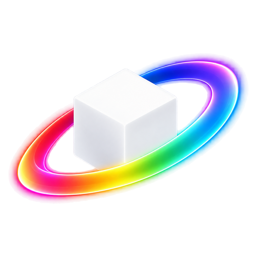
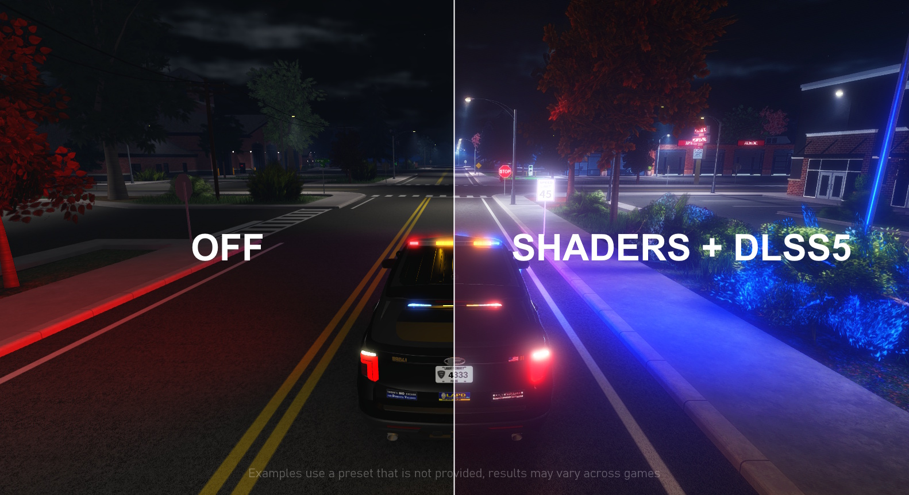

<p align="center">
  
</p>

<h1 align="center">RobloxShadeHost</h1>

<p align="center">Use ReShade with Roblox.</p>

<p align="center">
  <a href="https://github.com/OMouta/RobloxShadeHost/releases/latest">Download for Windows</a>
  &nbsp;·&nbsp;
  <a href="#download-and-set-up">Setup guide</a>
  &nbsp;·&nbsp;
  <a href="https://discord.gg/wVbVUdENas">Discord &amp; community presets</a>
</p>



#### *If you like this project, please consider starring to support development and help others find it.*

<a href="https://www.star-history.com/?repos=omouta%2Frobloxshadehost&type=date&releases=&legend=bottom-right">
 <picture>
   <source media="(prefers-color-scheme: dark)" srcset="https://api.star-history.com/chart?repos=omouta/robloxshadehost&type=date&theme=dark&legend=bottom-right" />
   <source media="(prefers-color-scheme: light)" srcset="https://api.star-history.com/chart?repos=omouta/robloxshadehost&type=date&legend=bottom-right" />
   
 </picture>
</a>

## Read this first

> [!NOTE]
> If DLSS5 is stuck on "waiting", follow the [DLSS5 troubleshooting guide](DLSS5-README.md).

**How do I get it?** Download RobloxShadeHost-Setup from the [latest release](https://github.com/OMouta/RobloxShadeHost/releases/latest) and run it like any other installer. It downloads ReShade and its effects for you. Keep the folder it suggests, or pick any folder of your own. Do not install it inside the Roblox folder, and do not install ReShade onto Roblox itself. The host is a separate program that runs beside Roblox and never touches Roblox's files.

**Will it slow my game down?** Yes. This is experimental and lowers your FPS, because the host copies Roblox's picture every frame and draws the effects on top.

**How do I open the ReShade menu?** Press **Home** while Roblox is in front. ReShade opens over the game and gets your mouse and keyboard. Pick a preset or change effects, then press **Home** again to go back to playing. Your effects stay on.

## Download and set up

Use 64-bit Windows 10 version 1903 or newer, or Windows 11. Windows Graphics Capture must be available on your system.

### Installer (recommended)

1. Download **RobloxShadeHost-Setup** from the [latest release](https://github.com/OMouta/RobloxShadeHost/releases/latest).
2. Run it and choose an installation folder.
3. Keep **Presets** selected. Optionally select **Depth estimation** or **DLSS5**. They do not work together, so Setup lets you pick only one. ReShade and its effects are always installed.
4. Accept the ReShade license. Setup downloads everything it needs. If an optional add-on cannot be downloaded, Setup skips it and installs the rest.
5. Keep the default shortcuts or choose your own.
6. Open Roblox and launch **RobloxShadeHost** from the Start menu. Either can be started first; the host waits if Roblox is not open yet.

To change shortcuts or add-ons later, update, or uninstall, open **RobloxShadeHost Setup** from the Start menu.

The installer downloads every effect package from ReShade's official list. The presets component installs the presets from this repository's `presets` folder next to the host; load one from the ReShade menu.

### Manual installation

1. Download **RobloxShadeHost.exe** from the [latest release](https://github.com/OMouta/RobloxShadeHost/releases/latest).
2. Put it in its own folder somewhere you can write files, such as `Desktop\RobloxShadeHost`. Keep it in that folder after installing ReShade.
3. Download a current ReShade installer from [reshade.me](https://reshade.me/#download). **The version with full add-on support is recommended.** The standard version also works, but depth estimation and DLSS5 need full add-on support.
4. Run the ReShade installer. Browse to **RobloxShadeHost.exe**, not the Roblox executable.
5. Select **Microsoft DirectX 10/11/12** as the rendering API.
6. Select your preset if you have one, choose the effect packages you want, and finish installation.
7. Open Roblox and run **RobloxShadeHost.exe**. Either can be started first. If Roblox is not open yet, the host waits for it.

**Old DirectX ReShade installations, such as DirectX 9 or earlier, will not work with this host.** Choose DirectX 10/11/12 even if a guide for another program tells you otherwise. Use a current ReShade release rather than copying an old installation from another game.

Keep the files ReShade installs beside RobloxShadeHost.exe, including `dxgi.dll`, `ReShade.ini`, and the shader folders. ReShade is downloaded separately and is not bundled with the EXE.

## Depth-based effects

> [!WARNING]
> The DLSS5 add-on does not work with Depth Anything V2!

Roblox's depth buffer is not available outside its process, so the host estimates depth from the captured image with Depth Anything V2. Ambient occlusion, depth of field, fog and other effects that read depth then work from that estimate. Objects that look close in the image are close in the estimate, but distances are relative and edges are softer than a real depth buffer.

Select the **Depth estimation add-on** in the installer. For a manual installation, put `onnxruntime.dll` and `DirectML.dll` from the [depth-assets release](https://github.com/OMouta/RobloxShadeHost/releases/tag/depth-assets) and the [model](https://huggingface.co/onnx-community/depth-anything-v2-small/resolve/4472b7362082ad9968fee890ca0f1e5aca36b93d/onnx/model_fp16.onnx) saved as `depth-anything-v2-small.onnx` into the host folder. The add-on needs ReShade with full add-on support and a DirectX 12 capable GPU.

The model shares the GPU with Roblox and costs some frame rate. If that matters more than depth effects, run RobloxShadeHost Setup and deselect **Depth estimation**, or delete the model file.

## Open the menu and adjust effects

1. Click into Roblox and press **Home**. ReShade opens over the game and gets your mouse and keyboard. A badge at the bottom of the screen shows the shortcut that returns them to Roblox.
2. Follow ReShade's first-run tutorial, choose a preset, or adjust your effects.
3. Press **Home** again to close ReShade and keep playing. Closing the menu with ReShade's own key does the same. Your effects remain visible.

ReShade's effect toggle and individual effect shortcuts only reach ReShade while its menu is open. The host does not forward them while you are playing.

Switching to another application closes the menu and returns input to Roblox.

## Change the shortcuts

Open **RobloxShadeHost Setup** from the Start menu and choose **Change shortcuts**. Click a shortcut, press the keys you want, save, and restart the host.

Setup stores them in **RobloxShadeHost.ini** beside the EXE, which you can also edit by hand while the host is closed:

```ini
[Input]
ToggleKey=Home
OverlayToggleKey=Ctrl+F8
```

`ToggleKey` opens and closes ReShade. If you installed an earlier version, your INI keeps its old `ToggleKey`, such as `Ctrl+Home`, until you change it.

Supported keys:

- Letters `A` through `Z` and digits `0` through `9`.
- `F1` through `F24`, except `F12`, which Windows reserves.
- `Home`, `End`, `Insert`, `Delete`, `PageUp`, `PageDown`, `Pause`, `ScrollLock`, `Space`, `Tab`, and `Escape`.
- Optional modifiers `Ctrl`, `Alt`, `Shift`, and `Win`, placed before the key and separated by `+`.

Names are case-insensitive. Avoid keys you use for gameplay and Windows shortcuts such as Alt+Tab. If a shortcut is invalid or another program already owns it, the host says so in its console and log.

The host only holds `ToggleKey` while Roblox or the ReShade menu is in front, so other programs keep the key. It holds `OverlayToggleKey` for as long as it runs.

Press **Ctrl+F8** to switch between the overlay and original Roblox footage. Leave `OverlayToggleKey` blank to keep it unassigned. Use a different shortcut from `ToggleKey`.

Turning the overlay off stops frame capture and returns input to Roblox. Press the shortcut again to resume capture and show the overlay.

## Everyday use

- Keep the host running while you play. Its console window checks your installation at startup, then shows capture status and errors. You can minimize it.
- The console's messages are also saved to **RobloxShadeHost.log** beside the EXE. The previous run's log is **RobloxShadeHost.old.log**.
- The overlay follows the Roblox window. It hides when Roblox is minimized or you switch away.
- If Roblox closes, the host waits for it to open again.
- To stop, close the host's console window. Roblox continues running.
- To update, run the newest RobloxShadeHost Setup. It keeps your settings, presets and shortcuts. For a manual installation, close the host and replace RobloxShadeHost.exe with the new download.
- To uninstall, open RobloxShadeHost Setup from the Start menu and choose **Uninstall**. For a manual installation, close the host and delete its folder after saving any presets you want to keep.

## Troubleshooting

### ReShade does not appear

At startup, the host's console lists what it found: ReShade, effects, add-ons and your GPU. Fix what it warns about and restart the host. For a manual installation, check that you installed ReShade on **RobloxShadeHost.exe** using **DirectX 10/11/12**. Then start a Roblox experience, bring its window to the front and press **Home**.

### I cannot move or click in Roblox

If the **Input captured** badge is visible, press the shortcut shown there or close the ReShade menu.

### My shortcut does not work

Bring Roblox to the front. The host's console reports shortcuts that are invalid or taken by another program; pick another one in RobloxShadeHost Setup and restart the host. Also check that you have not started a second copy of the host.

### A shader needs depth information

Install the depth estimation add-on, see [Depth-based effects](#depth-based-effects). Without it, the host only has Roblox's visible image, and effects that require depth will not work as intended. The estimate is not Roblox's own depth buffer, so effects that expect exact distances can need retuning.

### The host reports that capture is unsupported

Check your Windows version and graphics drivers. The host needs Windows Graphics Capture. To report another failure, open a [GitHub issue](https://github.com/OMouta/RobloxShadeHost/issues) with your Windows version and attach **RobloxShadeHost.log** from the host's folder.

## Build from source

For development, install Visual Studio 2022 with **Desktop development with C++**, a recent Windows SDK, and CMake 3.20 or newer. From the repository folder:

```powershell
cmake -S . -B build -A x64 -DBUILD_TESTING=ON
cmake --build build --config Release --parallel
ctest --test-dir build -C Release --output-on-failure
```

The EXE is at `build\Release\RobloxShadeHost.exe`. To build the installer as well, run `cmake --build build --config Release --target installer`; see [installer/README.md](installer/README.md).

GitHub Actions builds and tests the EXE for pushes and pull requests. You can also run **Build and release** manually from the Actions tab. Successful builds provide a `RobloxShadeHost-windows-x64` artifact containing the EXE and the installer.

To publish a release, push a version tag such as `v0.1.0`. After the build and tests pass, the workflow creates a GitHub release with the EXE attached. Branch pushes and manual builds do not publish releases.

Want to help? See [CONTRIBUTING.md](CONTRIBUTING.md) for bug reports, presets, and code changes.

## License

[MIT](LICENSE).
