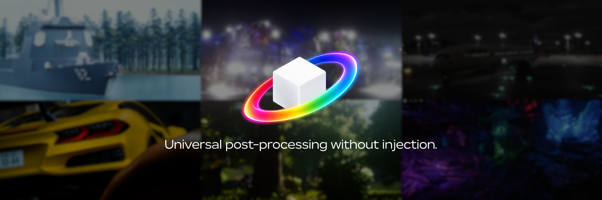

  

  <a href="https://unishade.me/download/">Download</a>
  &nbsp;·&nbsp;
  <a href="https://unishade.me/docs/">Docs</a>
  &nbsp;·&nbsp;
  <a href="https://discord.gg/wVbVUdENas">Discord</a>

Use ReShade on games that won't let you install it. Formerly RobloxShadeHost.

Downloads, docs and presets are on [unishade.me](https://unishade.me) and [Discord](https://discord.gg/wVbVUdENas). To build it or send a preset, see [CONTRIBUTING.md](CONTRIBUTING.md). [MIT license](LICENSE).
