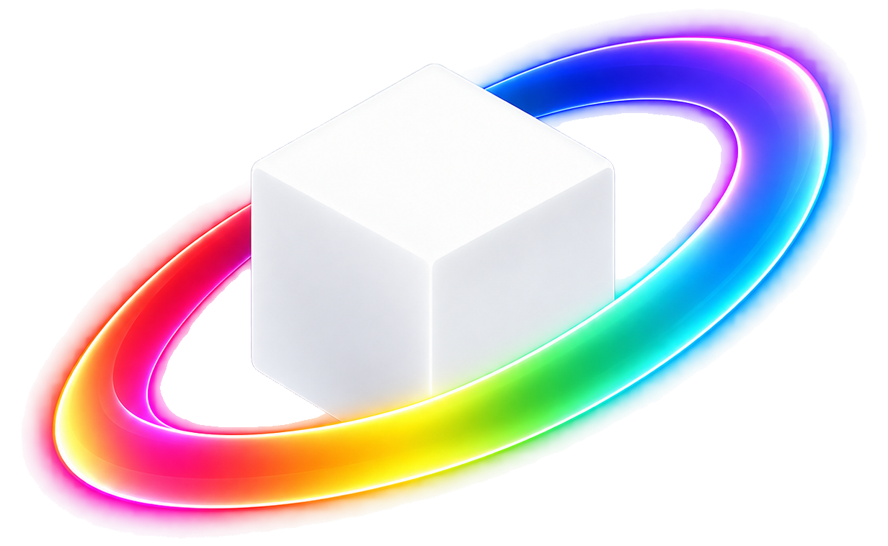
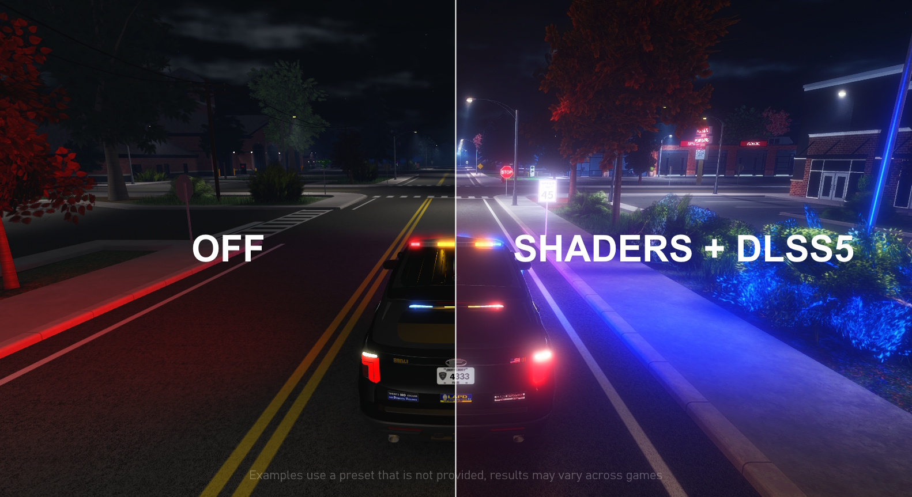
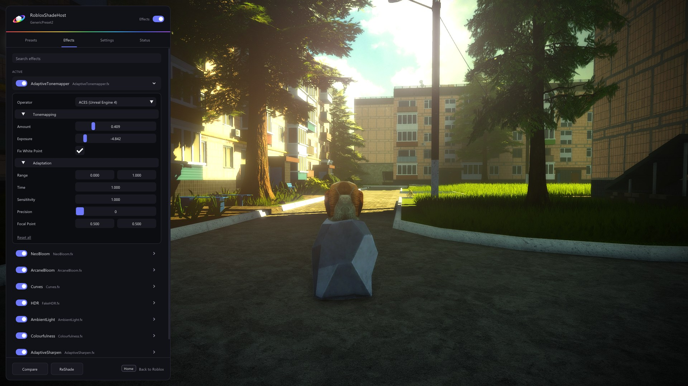

  

<h1 align="center">RobloxShadeHost</h1>

Run ReShade on Roblox without modifying the game.

  <a href="https://github.com/OMouta/RobloxShadeHost/releases/latest">Download for Windows</a>
  &nbsp;·&nbsp;
  <a href="https://pages.mouta.me/RobloxShadeHost/">Website</a>
  &nbsp;·&nbsp;
  <a href="https://pages.mouta.me/RobloxShadeHost/install/">Installation guide</a>
  &nbsp;·&nbsp;
  <a href="https://discord.gg/wVbVUdENas">Discord &amp; community presets</a>

RobloxShadeHost runs next to Roblox, copies its picture and draws ReShade's effects on top. It never touches Roblox's files, and nothing is loaded into the Roblox process.

#### *If you like this project, please consider starring to support development and help others find it.*

<a href="https://www.star-history.com/?repos=omouta%2Frobloxshadehost&type=date&releases=&legend=bottom-right">
 <picture>
   <source media="(prefers-color-scheme: dark)" srcset="https://api.star-history.com/chart?repos=omouta/robloxshadehost&type=date&theme=dark&legend=bottom-right" />
   <source media="(prefers-color-scheme: light)" srcset="https://api.star-history.com/chart?repos=omouta/robloxshadehost&type=date&legend=bottom-right" />
   
 </picture>
</a>

## Press Home, pick a look

The menu opens right over the game. Switch presets, turn effects on, and drag their sliders while you watch the result. Hold **Compare** to see plain Roblox for a second.

- **Every ReShade effect.** Setup installs every package on ReShade's official list, plus presets made for Roblox.
- **Depth effects.** Roblox keeps its depth buffer to itself, so the optional depth add-on estimates depth from the picture with an AI model. Ambient occlusion, depth of field and fog work from that.
- **DLSS5.** An optional add-on for NVIDIA RTX cards, through RenoDX.
- **One installer.** Setup downloads ReShade, the effects and the presets, and updates them later without touching your presets.

Effects cost frame rate. The host copies Roblox's picture every frame and runs the effects on your GPU next to the game.

## Get started

Download **RobloxShadeHost-Setup** from the [latest release](https://github.com/OMouta/RobloxShadeHost/releases/latest) and follow the [installation guide](https://pages.mouta.me/RobloxShadeHost/install/). You need 64-bit Windows 10 version 1903 or newer, or Windows 11.

## Help and updates

Ask on [Discord](https://discord.gg/wVbVUdENas). That is also where people share presets.

We only support the newest version, so update before asking. The host tells you when a new one is out. Run the new Setup and it keeps your presets and settings.

## Build from source

See [CONTRIBUTING.md](CONTRIBUTING.md) for building, presets and code changes.

## License

[MIT](LICENSE).
