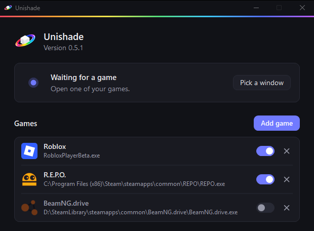

Run your games in windowed or borderless mode. Once a game is saved, Unishade starts on it whenever it opens.

## Add a game

1. Open the game.
2. Click **Add game** in the Unishade window.
3. Pick the game's window.

That's it. If the game isn't in the list, make sure its window isn't minimized and try again.

If you move a game to another folder, add it again.

## Turn a game off or remove it

The switch next to a game turns it off. The × removes it. Roblox is on the list from the start, so turn it off if you don't play it.

## Playing more than one

If several saved games are open, Unishade follows the one you're playing.

## Use a window just this once

**Pick a window** uses any open window without saving it. Unishade sticks to that window until you click **Detect automatically**.

## Games that don't work

Some games block screen capture or overlays, and those may not work.
