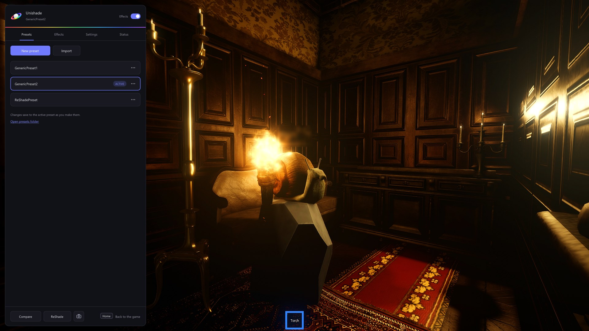
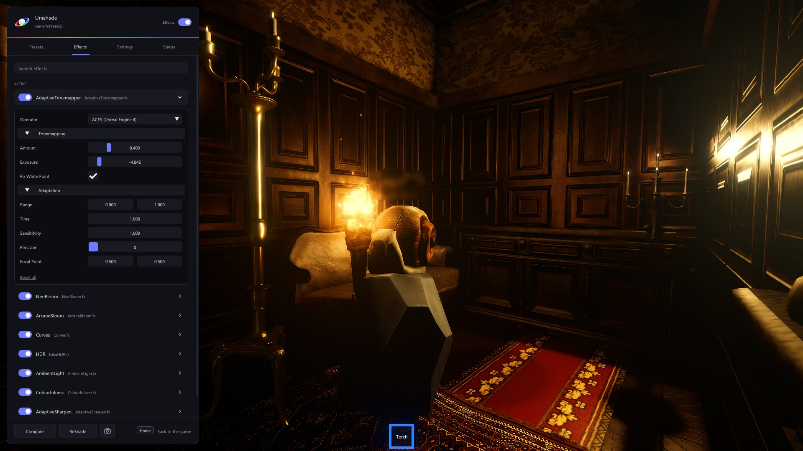

Click into the game and press **Home**. The menu opens right over the game. Press **Home** or **Escape** to go back to playing.

The switch at the top turns all effects off and on.

## Presets

The **Presets** tab lists your presets. Click one to switch to it. **New preset** starts an empty one, and **Import** copies preset files into your presets folder. The **...** button on a preset duplicates, renames or deletes it. Deleted presets go to the Recycle Bin.

Changes save to the preset as you make them. To try changes before keeping them, turn off **Save changes automatically** in **Settings**. The preset's name then gets a dot when it has unsaved changes, the save icon at the top saves them, and **Save as new** puts them in a new preset. Switching presets with unsaved changes asks whether to save them.

If a preset uses effects that aren't installed, the Presets tab names them.

**Ctrl+PageDown** and **Ctrl+PageUp** switch to the next and previous preset while you play.

People share presets on [Discord](https://discord.gg/wVbVUdENas).

## Effects

The **Effects** tab lists every installed effect with a switch. Click an effect to change its settings, and search at the top to find one. Right-click a setting to reset it, or click **Reset all** to reset the effect.

**ReShade** at the bottom of the menu opens ReShade's own menu.

## Compare

Hold **Compare** at the bottom of the menu, or hold **F7** in the game, to see the game without effects.

## Screenshots

**Ctrl+F9** saves a screenshot, and **Ctrl+F10** saves a before and after pair from the same frame. The camera button at the bottom of the menu does both and opens the screenshots folder. Screenshots never show the menu. New installs save them in `Pictures\Unishade`, and installs from before the rename keep `Pictures\RobloxShadeHost`.

## Shortcuts

| Shortcut | What it does |
| --- | --- |
| Home | Opens and closes the menu |
| Ctrl+F8 | Turns the overlay off and on |
| F7 | Shows the game without effects while held |
| Ctrl+F9 | Saves a screenshot |
| Ctrl+F10 | Saves a before and after pair |
| Ctrl+PageDown | Switches to the next preset |
| Ctrl+PageUp | Switches to the previous preset |

Change them in **Settings**: click a shortcut, then press the keys you want. They work right away. Ctrl+F8 works everywhere while Unishade runs. The others only work while the game or the menu is in front, so other programs keep those keys.
